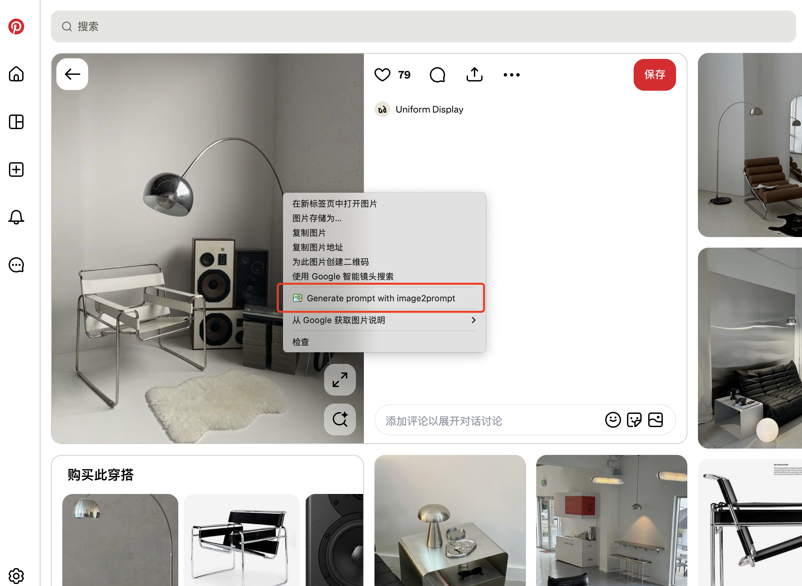

<h1 align="center">image2prompt</h1>

<div align="center">

[English](README.md)
[中文](README.zh-CN.md)
[Repository](https://github.com/doducan71037-hue/image2prompt)
[Safari Guide](README.safari.md)

</div>

## 🌟 Overview

**image2prompt** is a maintained fork of [`pingan8787/image2prompt`](https://github.com/pingan8787/image2prompt).
This version focuses on a cleaner prompt workflow, an updated result panel, additional prompt controls, local image support, and a Safari-ready bundle flow.

To use it, right-click an image on a webpage and run **Generate prompt with image2prompt** from the context menu. The extension analyzes the image, prepares a prompt, and lets you copy it or open it directly in your preferred AI platform.



## 🔧 This Fork

- Maintained fork of the original `image2prompt` project
- Redesigned prompt workflow and result panel
- Added prompt richness controls and structured JSON result view
- Added local image generation flow in the options page
- Added Safari-ready bundle generation and repository docs

## ⚙️ Features

| Feature Module              | Description                                                                                                          |
| --------------------------- | -------------------------------------------------------------------------------------------------------------------- |
| 🧩 **Model Selection**      | Switch between **Gemini 2.5 Flash** and **Zhipu GLM-4V** — each keeps its own API key and model ID                   |
| 🌏 **Multilingual Output**  | Generate prompts in 20 different languages                                                                           |
| 🖼️ **Image Size Filter**    | Only displays the button for images larger than the configured size (default: 256×256)                               |
| 📒 **Generation History**   | View all your generated prompts anytime                                                                              |
| 🎨 **Custom Platform Jump** | Configure the default AI platform: OpenAI / Gemini / StableDiffusion / JiMeng / Keling / Doubao / Hailuo AI / Custom |
| 💬 **Prompt Templates**     | Edit and customize prompt generation templates to build your unique style                                            |
| ✍️ **Custom Instructions**  | Enable a pre-generation dialog so you can blend extra guidance into every output                                     |
| 🧭 **Internationalized UI** | Easily switch between English and Chinese                                                                            |
| 🪶 **Lightweight UI**       | Inspired by shadcnUI, built with custom-drawn components and no third-party dependencies                             |
| 🧮 **Aspect Ratio Presets** | Pick cinematic ratios or add your own so every prompt respects the frame you need                                    |
| 🚫 **Domain Filters**       | Hide the capture button on sites you exclude so browsing stays distraction-free                                      |
| 🖼️ **Local Uploads**        | Drop local images directly in the settings page and generate prompts without leaving the dashboard                   |
| 🧾 **JSON View**            | Switch the result panel between Chinese, English, and structured JSON output                                         |
| 🧭 **Safari-ready Bundle**  | Includes a tracked `safari-web-extension/` bundle and a script to regenerate it                                      |

## 🌈 Installation

1. Clone or download this fork:

```bash
git clone https://github.com/doducan71037-hue/image2prompt.git
```

2. Install the extension for Chrome or Edge

After downloading the project, open the Chrome/Edge Extensions page: `chrome://extensions/` / `edge://extensions/` enable **Developer mode**, then drag the entire project folder into the page.

Alternatively, click Load unpacked, then select the project folder.


3. Safari on macOS

This repository includes a Safari-ready bundle at `safari-web-extension/`.

For Mac users who want to use the extension locally:

- Use Safari's temporary web extension folder install flow in macOS Safari
- Select the `safari-web-extension/` folder
- You may need Safari's developer features enabled, including the Develop menu and unsigned extension allowance

For developers who want to package or distribute a Safari version:

- Use `./scripts/prepare-safari-bundle.sh` to regenerate `safari-web-extension/`
- Convert the folder with Xcode's converter when needed
- See [README.safari.md](README.safari.md) for the Safari-specific workflow

## 🍭 Usage

After installing the extension, open the configuration page to choose your provider and set the corresponding API key:

- Gemini: [Create a Gemini API key](https://aistudio.google.com/app/api-keys)
- Zhipu AI: [Zhipu model overview & console](https://docs.bigmodel.cn/cn/guide/start/model-overview)


Then right-click any image on a webpage and choose **Generate prompt with image2prompt**.

Want to blend in extra guidance (for example, “switch the background to a neon city”)? Enable **Custom instructions input** in **Settings → Prompt Generation** to open a dialog before each run and merge your tweaks with the system prompt.

## 🧭 Upstream

Original project: [`pingan8787/image2prompt`](https://github.com/pingan8787/image2prompt)

## 📝 Repository Note

- This repository is presented as a maintained fork, not the original project.
- The upstream repository does not currently include an explicit `LICENSE` file, so review licensing before redistribution or commercial use.
